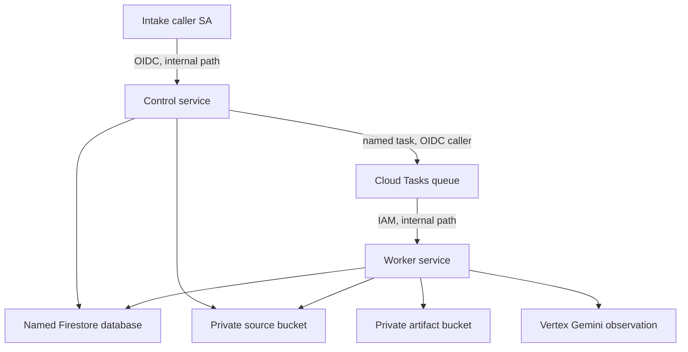

# Phase 2 cloud shadow architecture

## Decision

Phase 2 targets Google Cloud Tasks plus two private Cloud Run services, but the
current package is an inert source candidate and deployment review scaffold.
It creates containment and identity boundaries before any runtime activation.
It does not replace the
Phase 1 SQLite authority and does not process customer work. The isolated
runtime implements Firestore admission and leases, Cloud Tasks dispatch, private
GCS input and output, OIDC HTTP boundaries, and a fixed Vertex Gemini adapter.

The intended settled baseline breaks the arrows on purpose: both revisions
receive zero traffic, the queue is paused, Scheduler is absent, and application
controls remain paused and off. The apply script is hard-disabled before cloud
calls until Cloud Run creation is atomically create-only and queue creation is
initially paused without a second-command window. The diagram is the intended
authenticated topology after future activation evidence exists, not a claim of
a deployed or active service.
In particular, the intake caller service account is intentionally unattached.
Local Phase 1 and Site Studio cannot reach internal-only control. Activation
must name and provision a real cloud ingress workload and internal network path.

## Responsibilities

| Component | May do | Must not do |
| --- | --- | --- |
| Control Cloud Run service | Authenticate intake, enforce idempotency, persist admission, create a named task | Execute work, accept public traffic, exceed 20 accepted pilot jobs |
| Cloud Tasks queue | Preserve at-least-once dispatch intent at low rate | Dispatch while paused, run more than one concurrent request |
| Worker Cloud Run service | Claim a fenced synthetic job, call fixed Vertex Gemini for a shadow observation, persist evidence | Admit jobs, produce a customer build, message, callback, publish, deploy, or write customer source |
| Named Firestore database | Hold cloud shadow admission, job, lease, transition, outbox, and control records | Fall back to `(default)` or become authority for Phase 1 data without migration evidence |
| Source bucket | Hold immutable, digest-checked pilot inputs | Serve publicly, contain credentials, or grant delete access to a runtime |
| Artifact bucket | Hold immutable Vertex observation artifacts and receipts | Serve publicly, contain credentials or customer source, or grant delete access to a runtime |
| Scheduler | Future bounded reconciliation trigger | Exist in the inert baseline or run before explicit activation |

## Identity and IAM

Control and worker revisions use distinct runtime service accounts. Three
dedicated caller service accounts separate admission, reconciliation, and task
execution. The intake and scheduler callers receive `roles/run.invoker` on the
control service. The task caller receives it only on the worker service. The
application then admits each caller only on its matching route. The baseline
does not install a user principal as a usable intake identity. The three caller
accounts are pairwise distinct, and the control and worker URLs use distinct
origins. All five runtime and caller service accounts are distinct.
Both service origins use the no-slash deterministic Cloud Run form
`https://SERVICE-PROJECT_NUMBER.REGION.run.app`; online plan verifies the
numeric project number and a future create-only apply must compare each deployed
`status.url` exactly.

The control runtime can enqueue only to the Phase 2 queue and receives
`roles/iam.serviceAccountUser` only on the task caller service account so it can
attach that OIDC identity to a task. On the queue, control also has
`roles/cloudtasks.viewer`, because exact `ALREADY_EXISTS` convergence reads the
named task with `responseView=FULL`. The combined queue-scoped roles provide
`cloudtasks.tasks.create`, `cloudtasks.tasks.get`, and
`cloudtasks.tasks.fullView` without task deletion.

The control runtime can create and view source objects. The worker runtime can
view source objects and create and view artifact objects. Neither receives
`roles/storage.objectUser`, object admin, or delete permission. The worker alone
receives `roles/aiplatform.user`. Both runtime accounts receive Firestore user authority
at project scope because Google Cloud IAM does not use the database ID as this
package's security boundary. The application must therefore reject any database
ID other than the configured named Phase 2 database. This is a known least-
privilege limitation. Runtime configuration and tests fail closed on a
mismatched database selection.

Neither Cloud Run service grants an unauthenticated principal. Internal ingress
is a second boundary and does not replace IAM. No long-lived service-account key
is created.

## Durable state contract

Cloud Tasks provides at-least-once delivery. The implemented adapter keeps the
Phase 1 invariants: one stable idempotency key, atomic admission plus dispatch
intent, named task reconciliation, leases with fencing tokens, bounded retry,
stale-completion rejection, deterministic artifact identity, and visible dead
letters. A successful HTTP response is not proof that a customer effect occurred.

Each submitted dispatch records a bounded worker-claim acknowledgement deadline.
The worker acknowledges the current task name and dispatch generation in the
same Firestore transaction that claims the job. If no durable claim exists at
the deadline, reconciliation advances to a new deterministic dispatch generation
or parks the job for manual review at the configured bound. A delayed task from
an older generation fails identity validation before it can reserve a model call.
This closes the gap between Cloud Tasks accepting a task and the worker durably
claiming it.

An `ALREADY_EXISTS` response converges only after a `FULL` task read matches the
exact target, IDs-only body and OIDC identity. If that read fails, the existing
task cannot be classified as safe. The job is parked immediately with
`execution_risk=unknown`; it is not treated as an ordinary retryable submission.

A model-call reservation is bound to the active attempt inside the reservation
transaction. If that transaction commits but its response is lost, the runtime
can discover the bound call and settle it at zero only when the failure is proven
to be pre-provider and every provider metric is empty or zero. Any other state
remains uncertain or fails closed rather than silently releasing reserved cost.

Firestore is assumed to be a pre-existing named database. The infrastructure
scripts only describe it. They never create one and never substitute the default
database. No migration, dual write, catch-up of parked legacy jobs, schedule
import, or authority cutover belongs to this baseline.

## Safety controls

Safety is layered so a single mistaken toggle is insufficient:

1. `global_pause` is on.
2. `dispatch_enabled` is off.
3. `worker_enabled` is off.
4. `provider_enabled` is off.
5. the effect firewall denies customer effects.
6. accepted jobs have a hard cap of 20.
7. the queue is `PAUSED`, limited to 0.1 dispatches per second, concurrency 1,
   and at most three attempts.
8. both services scale from zero to at most one instance and use concurrency 1.
9. new image digests receive no traffic.
10. Scheduler is absent until a separately reviewed activation change.
11. all pilot inputs must be synthetic or disposable.

A cloud budget is an alert, not a hard cap. Budget notifications are required
before any future apply, while queue, scaling, and application limits constrain
work. The application must transact the 20-job cap with admission so concurrent
requests cannot exceed it.

`FAMTASTIC_PHASE2_RUNTIME=1` selects the isolated runtime. It does not change
persistent controls. Firestore bootstrap creates all four controls in their safe
state, including `provider_enabled=false`. A real Vertex Gemini request is
possible only after global, worker, and provider controls are independently
enabled. Its result is a priced, bounded shadow observation that parks at the
review gate. It is never a customer build and cannot authorize an external
effect.

The Vertex client is pinned to `@google/genai` in Vertex mode with stable API
version `v1`, `gemini-3.1-flash-lite`, and thinking level `MINIMAL` with thought
summaries excluded. Thinking can still consume tokens, so reported thinking and
candidate tokens share the output bound and both are priced as output. Response
text may carry an opaque thought signature, which is ignored. Thought summaries,
tool calls, function calls, and executable content are rejected. A real GCP
canary is still false in proof output and remains an activation requirement.

The current provider input is the exact bounded staging-packet reference: IDs,
artifact paths, digests, roles, and declared byte counts. It does not download
or send selected preview bytes to Vertex. The observation proves only the
execution, recovery, identity, and cost-accounting path. It cannot assess visual
quality or design content. A content-aware pilot needs a separately reviewed,
bounded, digest-verified input path before activation.

## Secrets

The baseline uses Google-signed OIDC tokens and creates no secret. Secret Manager
is added only if a later intake contract explicitly requires HMAC. Such a change
must grant access only to the control runtime, pin versions, rotate with a bounded
overlap, and keep values out of images, environment files, tasks, logs, and
evidence receipts.

## Container and source boundary

Control and worker are separate images built with role-specific context filters.
The shared Phase 2 package contains schemas, storage adapters, dispatch, recovery,
provider, and effect-firewall code, but no ambient site, credentials, or customer
data. An unfiltered repository-root build is rejected. Deploy accepts Artifact
Registry digests only, never tags. Each
receipt binds source SHA, context, provenance, digest, revision, and observed
traffic. The inert baseline requires both service names to be absent before
apply because a no-traffic deployment preserves older traffic on an existing
service. Images must come from the configured project's regional Artifact
Registry repository. Online plan describes that exact repository and both exact
image digests. A future create-only apply must repeat those read-only checks
before its first mutation.
The returned fully qualified image name must match the configured registry,
project, repository, package, and digest, so Cloud Run dry-run alone is not
treated as provenance evidence.

The intended baseline is one-shot and must adopt no existing queue, bucket,
Scheduler job, service account, or Cloud Run service. Queue, bucket and service
account creation commands are create-only, but `gcloud run deploy` is
create-or-update. An absence check cannot close the time-of-check to time-of-use
window for Cloud Run. The current apply script therefore exits before its first
cloud call and has no accepted create-only gate value. A separately reviewed
change must use an atomic create-only API or equivalent precondition before any
baseline apply is authorized.

The visible review scaffold also creates the Cloud Tasks queue and pauses it in
two separate commands. That creates an initial-running-state window even when no
producer should yet exist. A future apply path must prove the queue is born
paused, or establish an equivalent atomic containment boundary, before this can
be called an inert cloud baseline. The hard-disabled script does not exercise
that sequence in this change.

The Dockerfiles target `server/cloud/control-main.js` and
`server/cloud/worker-main.js`. Their matching ignore files expose only package
metadata, the role-specific HTTP files, and the isolated Phase 2 kernel. The
containers remain unbuilt and undeployed in this change.

## Activation gates

Activation requires a new reviewed change and independent proof of:

- control and worker HTTP contracts with authenticated audiences;
- a named cloud ingress workload and internal network path for the unattached
  intake caller service account;
- Firestore atomicity, idempotency, lease fencing, retry, dead-letter, and
  artifact recovery semantics;
- complete stored document, job, attempt, model-call, outbox, pilot and dispatch
  generation ownership bindings before every mutation or cost settlement;
- transaction-local timestamps captured inside each Firestore retry callback so
  contention cannot shorten reservations, leases or acknowledgement deadlines;
- pause checks at admission, dispatch, claim, and immediately before execution;
- a transactional 20-job cap and a synthetic-only allowlist;
- provider gating plus effect-firewall denial for callback, message, publish,
  deploy, customer repository, and payment paths;
- a real GCP canary proving the pinned Vertex `v1` request, structured output,
  usage accounting, and zero customer effects;
- zero-traffic revision probes and explicit revision traffic promotion;
- an initially paused queue with no create-then-pause exposure;
- Scheduler creation followed by a proven paused state before any later resume;
- queue resume and Scheduler resume as separate exact human gates;
- an operator procedure that accounts for provider requests already in flight,
  because a pause cannot cancel a Vertex request after submission;
- a completed evidence receipt with zero customer effects.

Client selection and acceptance do not satisfy a cloud activation gate. No
routine Fritz approval rule is added by this architecture.

## Stop and rollback

Containment order is queue pause, Scheduler pause if present, application global
pause, dispatch off, worker off, IAM invoker removal or known-good internal
traffic rollback, then evidence capture. Destructive cleanup is deferred. Keep
Firestore rows, tasks, artifacts, revisions, and logs until reconciliation shows
no active lease, orphaned admission, unclassified retry, or missing artifact.

The application pause is an exact-gated, pause-only Firestore transaction. It
binds the configured project, named database, and active pilot, then verifies
all four safe control values. A failure is recorded but does not stop later IAM
containment attempts. No paired enable command exists in this package.

Containment prevents new admissions, dispatches and provider submissions after
the gates take effect. It cannot cancel a Vertex request that was already sent.
Such a request may still complete and incur cost, so stop evidence must retain
the job, attempt, model-call ledger and logs until the outcome and accounting are
classified. The effect firewall still prevents that observation from becoming
a callback, message, publish, deploy, customer-source write or payment.

Rollback means restoring a recorded digest and revision or returning to the
inert zero-traffic baseline. It never means deleting evidence or mutating the
Phase 1 SQLite database. The operational checklist and receipt template live in
`infra/gcp/phase2/`.
