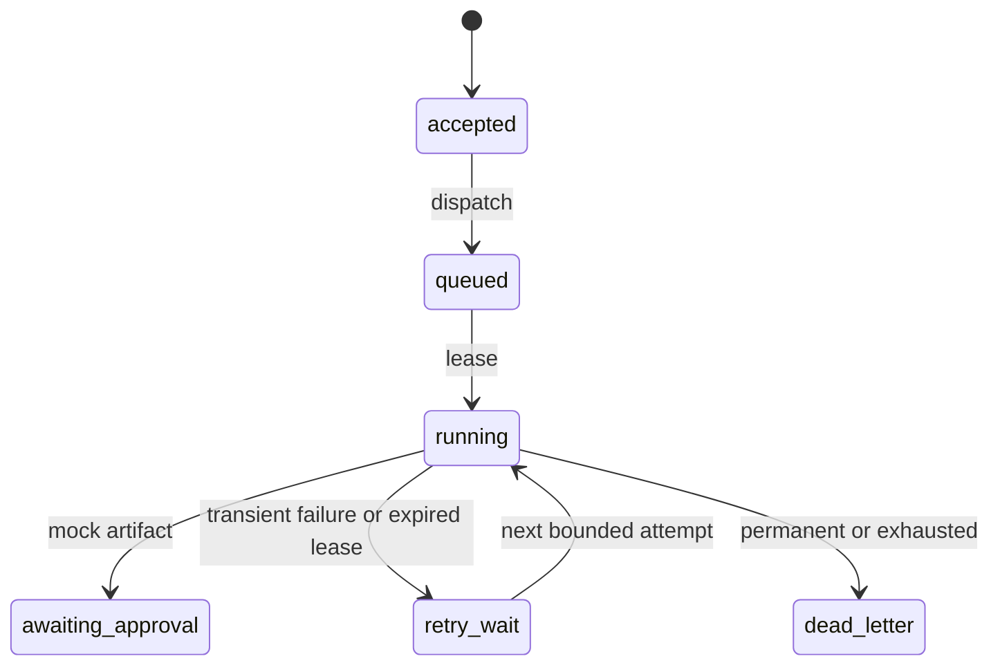

# Durable execution Phase 1 evidence

## Scope

This branch closes the first execution gap without enabling production work.
The signed staging route stores durable acceptance before returning 202. A local
mock-only runtime proves dispatch, leasing, recovery, retries, artifacts, pilot
gating and dead letters. No runner, daemon or schedule is started.

## Authority and projections

SQLite is the Phase 1 authority. One transaction creates:

1. One contract-compatible `AgentTaskLog` row.
2. One `ExecutionJobs` row bound to site and idempotency key.
3. One `ExecutionOutbox` dispatch intent.
4. One initial state transition.

The per-site journal and event spine are idempotent post-commit projections. A
projection failure is recorded on the outbox and does not turn committed intake
into a false failure. `reconcileAcceptanceProjections` retries pending projection
records. Identical intake returns the original receipt; different content under
the same key returns 409.

## State and recovery

`awaiting_approval` is a Phase 1 pilot observation gate. It is not a new Fritz
approval requirement for routine selected-site builds and it does not represent
customer acceptance, checkout eligibility or production launch.

## Fail-closed controls

- Global pause defaults on; dispatch and worker execution default off.
- The worker checks pause at claim time and again immediately before the mock.
- Only the internally branded, data-driven mock provider can execute.
- Callback, outbound message, publish and deployment effects always throw.
- Provider and attempt outcome identities must agree; mock cost must equal zero.
- Leases expire, carry fencing tokens and reject stale completion.
- Retry count is bounded; exhausted work becomes a visible dead letter.
- Artifacts use deterministic bytes, no-overwrite identity and directory fsync.
- The database must be a direct child of the execution root, use the disposable
  suffix, be a regular single-link file and have the execution application ID.
- New database files are created mode 0600 and the execution root is mode 0700.
- Phase 1 environment gates are exact: `mock` and `phase1-disposable`.

## Local proof result

`npm run prove:execution` builds a synthetic fixture with 448 parked legacy jobs,
seven enabled schedules and three performance records. It then processes 20
jobs with controlled duplicates, missing-intent repair, two abandoned leases,
three first-attempt transient failures, one permanent failure and one retry
exhaustion.

Expected result:

| Measure | Expected |
| --- | ---: |
| Awaiting pilot gate | 18 |
| Dead letters | 2 |
| Attempts | 27 |
| Mock model calls | 25 |
| Database artifacts | 18 |
| On-disk artifacts | 18 |
| Actual model cost | 0 |
| Active leases, orphans, duplicate artifacts | 0 |
| Observed process-network hooks and runtime effect attempts | 0 |
| SQLite integrity | ok |
| Foreign key violations | 0 |

The CLI blocks and counts fetch, HTTP, HTTPS, TCP and TLS hooks while it runs,
and also reads mock-provider and effect-firewall telemetry. It validates every
invariant before printing `status: passed`; it exits nonzero on a mismatch.

The focused branch suite passes 42 of 42 tests. The repository-wide suite in
this Linux workspace passes 958 of 981 tests, with 23 failures across nine
existing browser, pipeline, repository and revenue-safety files. The captured
failures include an unavailable Playwright Chromium binary and required absolute
Mac repository paths that do not exist here. No durable execution, staging or
journal test failed. This is not a claim that the full repository is green; the
independent Mac session must rerun and classify every failure.

## Evidence boundary

The local fixture proves only synthetic preservation. It did not open or modify
`~/.config/famtastic/studio.db`, Google Cloud, Oracle Cloud, a model API, a live
schedule, callback, email, repository deployment or customer site. The actual
448, seven and three counts reported by the earlier read-only assessment must be
verified on the Mac against an SQLite online-backup copy. Use the companion
[independent verification prompt](../handoffs/DURABLE-EXECUTION-VERIFICATION-PROMPT.md).
